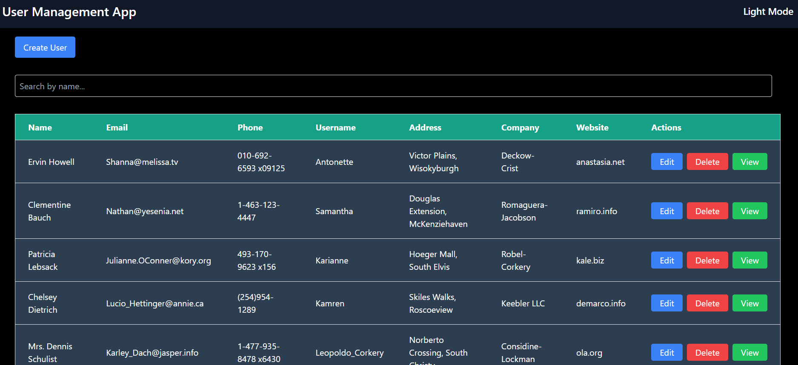

# Assignment Synergy Labs React

Assignment Synergy Labs React is a modern web application that demonstrates efficient data handling and user management using the latest technologies. This project showcases a user interface for managing users with functionalities for creating, reading, updating, and deleting (CRUD) user data.

## Technologies Used

- **React:** A JavaScript library for building user interfaces. React helps in creating reusable UI components and managing application state efficiently.
- **Vite:** A build tool that provides a fast development environment with lightning-fast hot module replacement (HMR). Vite is used to set up and manage the development workflow.
- **Tailwind CSS:** A utility-first CSS framework for styling the application. Tailwind CSS allows for rapid UI development with pre-defined classes for styling.
- **TypeScript:** A superset of JavaScript that adds static types. TypeScript helps in writing more maintainable and error-free code by providing type safety.
- **axios:** A promise-based HTTP client for making requests to the backend. Axios simplifies data fetching and handling.
- **react-router-dom:** A library for handling routing in React applications. It enables navigation between different views or pages within the application.

## Features

- **Fetch Data:** Retrieve user data from an external service and display it within the application.
- **CRUD Operations:** Implement Create, Read, Update, and Delete functionalities to manage user data effectively.
- **Search by Name:** Quickly find users by typing their name in the search bar to filter the user list.
- **Loading Spinner:** Visual feedback in the form of a loading spinner is displayed when data is being fetched or an operation is in progress, enhancing user experience.
- **Dark and Light Mode:** Toggle between dark and light themes for a personalized user experience.

## How to Install and Run Locally

This project is built using Vite and React. Follow the steps below to run it locally:

1. Clone the repository:
   ```bash
   git clone https://github.com/amankashyap004/assignment-synergy-labs-react.git
   ```
2. Navigate to the project directory:
   ```bash
   cd assignment-synergy-labs-react
   ```
3. Install dependencies:
   ```bash
   npm install
   ```
4. Start the development server:
   ```bash
   npm run dev
   ```
5. Open your browser and go to `http://localhost:5173` to see the application in action.

## Screenshots

A sleek and modern homepage design showcasing the user management interface.



## Live Demo and Repository

- Live Demo: **[Assignment Synergy Labs React](https://assignment-synergy-labs-react.vercel.app/)**
- GitHub Repository: **[Assignment Synergy Labs React](https://github.com/amankashyap004/assignment-synergy-labs-react.git)**

## Folder Structure

The project is organized as follows:

```plaintext
ASSIGNMENT-SYNERGY-LABS-REACT/
├── node_modules/
├── public/
│   └── images
├── src/
│   ├── assets/
│   ├── components/
│   │   ├── ui
│   │   │    ├── Button.tsx
│   │   │    ├── Modal.tsx
│   │   │    └── Spinner.tsx
│   │   ├── Footer.tsx
│   │   ├── Header.tsx
│   │   ├── ThemeToggleButton.tsx
│   │   ├── UserForm.tsx
│   │   └── UserTable.tsx
│   ├── contexts/
│   │   └── ThemeProvider.tsx
│   ├── pages/
│   │   ├── Home.tsx
│   │   └── UserDetails.tsx
│   ├── service/
│   │   └── UserService.ts
│   ├── types/
│   │   └── User.ts
│   ├── App.css
│   ├── App.tsx
│   ├── index.css
│   ├── main.tsx
│   └── vite-env.d.ts
├── .gitignore
├── eslint.config.js
├── index.html
├── package-lock.json
├── package.json
├── postcss.config.js
├── README.md
├── tailwind.config.js
├── tsconfig.app.json
├── tsconfig.json
├── tsconfig.node.json
└── vite.config.ts
```

## Future Enhancements

- Better Color Combination: Enhance the design with a more appealing color palette to improve the visual aesthetics of the application.
- User Authentication: Implement user authentication and authorization to restrict access to certain functionalities.
- Enhanced Error Handling: Add more robust error handling and user feedback mechanisms to improve the user experience.

Feel free to contact me for any queries or suggestions.
